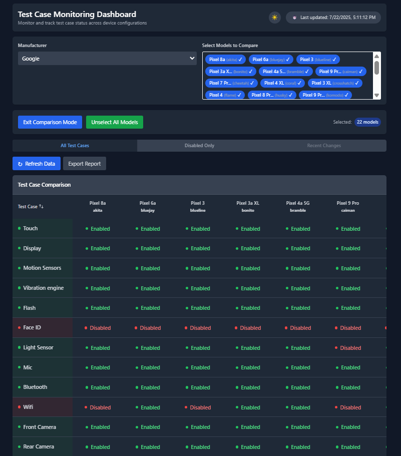
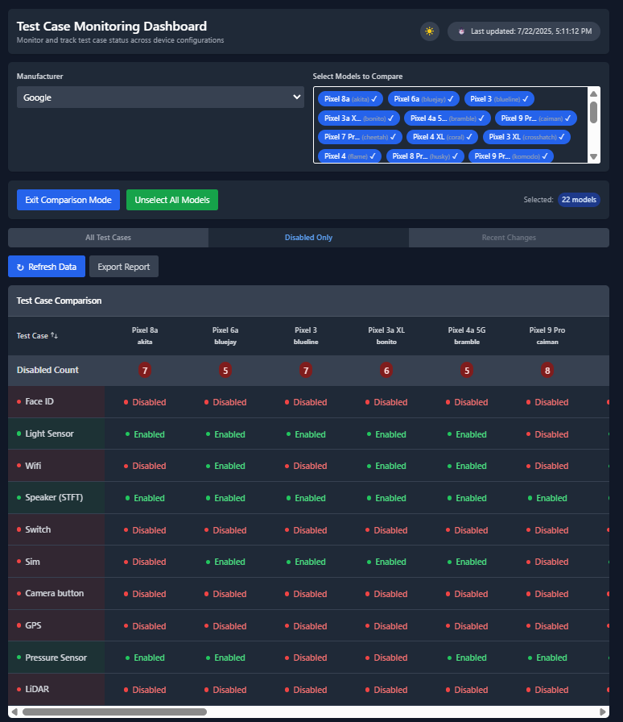

# Test Case Monitoring Dashboard

A comprehensive web application for monitoring and managing test case configurations across different mobile devices. This dashboard provides real-time test case management, multi-device comparison, advanced export capabilities, and direct configuration file editing with an intuitive dark-mode interface.

## Screenshots

### Dark Mode Interface with Multi-Device Comparison

*Main dashboard showing multi-device comparison in dark mode with device selection dropdown*

### Disabled Test Cases Filter View

*Filtered view showing only disabled test cases with count indicators for each device*

## Features

### Core Functionality
- **Device Management**: Browse and select from multiple device manufacturers (Apple, Google, Samsung, Motorola, TCL, etc.)
- **Test Case Tracking**: Monitor which tests are enabled or disabled for each device with real-time status updates
- **Real-time Toggle Switches**: Enable/disable test cases with toggle switches that directly modify device configuration files
- **Smart Test Grouping**: Automatically handles grouped tests (e.g., all button types for Button test, all speakers for Speaker test)

### Advanced Features
- **Dark Mode Support**: Professional dark theme with persistent preference storage via localStorage
- **Multi-Device Comparison Mode**: Compare test statuses across multiple devices simultaneously with visual indicators
- **Export Functionality**: 
  - **Excel Export**: Generates XLSX files with conditional formatting (red highlighting for disabled test cases)
  - **CSV Export**: Plain text format for universal compatibility
  - **Custom Format Selection**: Modal dialog for choosing export format
- **Configuration Viewer/Editor**: View and edit device configurations with syntax highlighting and real-time updates
- **Auto-Refresh**: Configurable automatic data refresh to keep information current

### User Experience
- **Filtering Options**: Three viewing modes - All Test Cases, Disabled Only, Recent Changes
- **File Synchronization**: Changes are saved directly to device configuration files with automatic backup creation
- **Error Notifications**: Visual feedback with color-coded notifications (green for success, red for errors)
- **Responsive Design**: Optimized for both desktop and mobile browsers
- **Disabled Test Count**: Real-time count display showing number of disabled tests per device

## Technology Stack

- **Frontend**: React.js with modern hooks and functional components
- **Backend**: Node.js with Express
- **Styling**: Tailwind CSS for responsive and clean UI
- **State Management**: React hooks for local state management
- **Code Organization**: Modular architecture with separated concerns

## Getting Started

### Prerequisites

- Node.js (v14.0 or higher)
- npm (v7.0 or higher)
- Device configuration files (.ini) in the designated directory

### Installation

1. Clone the repository:
   ```bash
   git clone https://github.com/Cwilliams333/test-case-dashboard.git
   cd test-case-dashboard
   ```

2. Install dependencies for both frontend and backend:
   ```bash
   npm install
   cd server && npm install
   cd ..
   ```

3. Configure environment variables:
   ```bash
   cp .env.example .env
   ```
   Then edit `.env` and update the paths to match your system:
   - `CONFIG_DIR` - Path to your device configuration (.ini) files
   - `PYTHIA_CONFIG` - Path to your pythia.conf file
   - Database settings (if using upload_configs.js)

### Running the Application

#### Development Mode
To run both frontend and backend servers concurrently:
```bash
npm run dev
```
- Frontend: http://localhost:3000
- Backend: http://localhost:3001

#### Production Mode
1. Build the frontend:
   ```bash
   npm run build
   ```

2. Run the production server:
   ```bash
   npm run prod
   ```
   The application will be served at http://localhost:3001

#### Alternative Production Start
Use the shell script for automated production deployment:
```bash
chmod +x start.sh
./start.sh
```

### Individual Server Commands
- Frontend only: `npm start` (port 3000)
- Backend only: `npm run server` (port 3001)

## Project Structure

```
├── public/
├── src/
│   ├── api/
│   │   └── index.js            # API client functions
│   ├── components/
│   │   ├── Modal.js            # Reusable modal component
│   │   ├── SyntaxHighlighter.js # Config file syntax highlighter
│   │   └── TestCaseMonitoringDashboard.js # Main dashboard component
│   ├── data/
│   │   └── testCaseMapping.js  # Test case data mappings
│   ├── utils/
│   │   └── parseConfig.js      # Configuration file parser
│   └── server.js               # Express backend server
└── package.json
```

## API Endpoints

The dashboard communicates with a Node.js backend server through these endpoints:

- `GET /api/devices` - Get all manufacturers and device models
- `GET /api/pythia-config` - Get Pythia configuration mapping
- `GET /api/device?model=[modelName]` - Get device configuration by model name
- `PUT /api/device` - Save device configuration changes to disk

## Configuration Files

The system reads and processes `.ini` configuration files with device specifications:

- Each device has its own `.ini` configuration file
- Test cases are enabled/disabled based on configuration sections
- The system maps configuration sections to test cases using predefined mappings

## Usage Examples

### Single Device Inspection

1. Select a manufacturer (e.g., Apple)
2. Choose a specific device model (e.g., iPhone 14 Pro)
3. View enabled/disabled test cases
4. Use toggle switches to enable/disable test cases in real-time
5. Click "View Configuration" to see or edit the raw config file

### Toggle Test Cases

1. Select a device from the sidebar
2. Use the toggle switches in the "Toggle" column to enable/disable tests
3. Changes are immediately saved to the device's .ini file
4. Green notification confirms success, red indicates errors
5. Some tests (Touch, Display, Root) cannot be toggled

### Multi-Device Comparison

1. Click "Exit Comparison Mode" to toggle into comparison mode
2. Select multiple devices from the dropdown (up to 22 models displayed)
3. View a side-by-side comparison of test case statuses
4. Monitor disabled test counts for each device
5. Use the "Disabled Only" filter to focus on problematic tests
6. Export comparisons using the Export Report button

### Exporting Data

1. In comparison mode, click "Export Report"
2. Choose your preferred format:
   - **Excel (.xlsx)**: Includes red cell highlighting for disabled test cases
   - **CSV (.csv)**: Simple comma-separated format for universal compatibility
3. File downloads automatically with timestamp in filename
4. Excel exports include conditional formatting for easy visual scanning

### Configuration Editing

1. Select a device and click "View Configuration File"
2. Toggle "Edit Mode" in the configuration viewer
3. Make desired changes to the configuration
4. Click "Save" to persist changes to disk
5. Modal automatically shows updated content after saving

### Using Dark Mode

1. Click the sun/moon icon in the top bar to toggle themes
2. Dark mode preference is saved automatically
3. Interface adapts all colors for optimal visibility
4. Works consistently across all views and modals

### Test Case Grouping

The system intelligently handles grouped test cases:
- **Button Test**: Toggles all button types (Power, VolumeUp, VolumeDown, Action)
- **Speaker Test**: Requires ALL speakers to be disabled for test to show as disabled
- **Mic Test**: Handles multiple microphone inputs
- **Camera Tests**: Manages front and rear camera configurations

## Configuration

### Environment Setup

The application uses environment variables to configure file paths. Create a `.env` file in the project root:

```bash
# Copy the example file
cp .env.example .env

# Edit .env and set your paths
CONFIG_DIR=/path/to/your/device/configs
PYTHIA_CONFIG=/path/to/your/pythia.conf
```

The application will use these environment variables, or fall back to default paths if not set.

For database configuration (used by `upload_configs.js`):
```bash
DB_USER=testcase_user
DB_HOST=localhost
DB_NAME=testcase_configs
DB_PASSWORD=yourpassword
DB_PORT=5432
```

### Test Case Mapping

Test cases are mapped to INI sections in `src/data/testCaseMapping.js`. To add new test cases:
1. Add to the `testCaseMapping` array
2. Map INI sections to test IDs in `iniSectionToTestMapping`

## Troubleshooting

### "Failed to load manufacturers" Error
- Ensure the backend server is running (`npm run server`)
- Check that configuration directory exists and contains .ini files
- Verify the CONFIG_DIR path in server.js

### Toggle Switch Not Working
- Check browser console for errors
- Ensure the test case has corresponding sections in the INI file
- Some tests (Touch, Display, Root) are intentionally non-toggleable

### Configuration Not Saving
- Check file permissions on the configuration directory
- Look for server logs showing save attempts
- Verify backup files are being created (.ini.backup)

## Contributing

1. Fork the repository
2. Create a feature branch (`git checkout -b feature/amazing-feature`)
3. Commit your changes (`git commit -m 'Add some amazing feature'`)
4. Push to the branch (`git push origin feature/amazing-feature`)
5. Open a Pull Request

## License

This project is licensed under the MIT License - see the [LICENSE](LICENSE) file for details.

## Acknowledgments

- Test framework integration with mobile device configurations
- Advanced React patterns for efficient state management
- Responsive design principles with Tailwind CSS
- Real-time file synchronization and backup management
